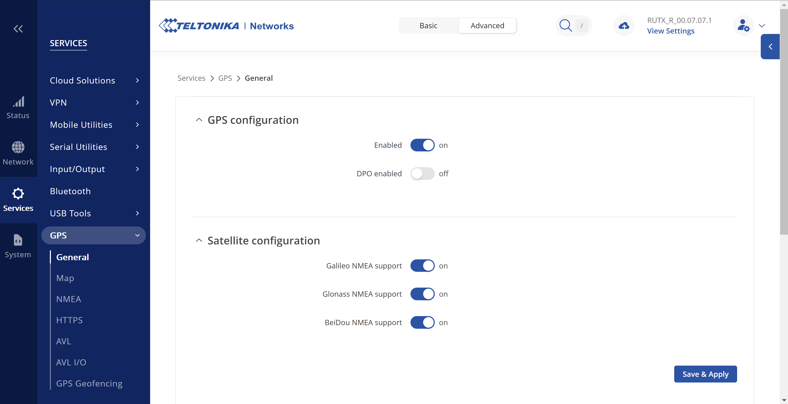
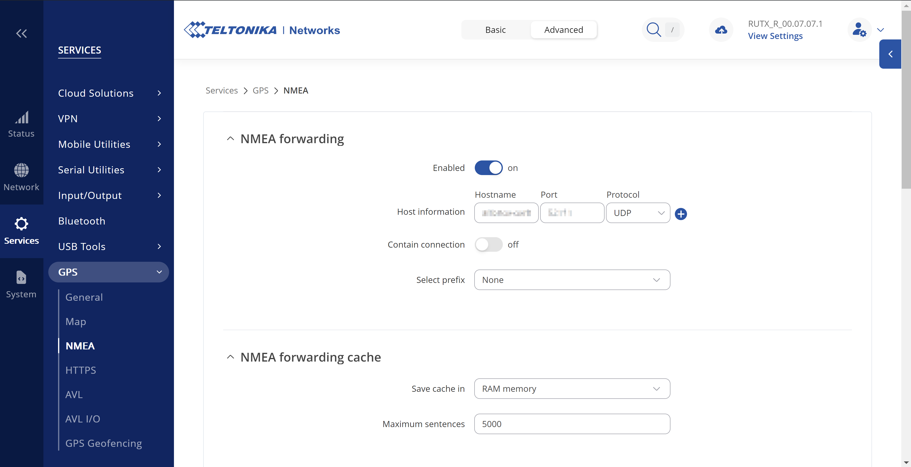

# Stream GPS data to a Venus OS device

If you have a network device with GPS ability, you can stream GPS data to your Venus OS device.

## Source configuration

Here, we shall create a UDP NMEA stream to the Venus OS device. As an example, here is the configuration for a RUTX device.

In RUTX web UI, go to *Services* -> *GPS* -> *General* and enable GPS :



Go to *Services* -> *GPS* -> *NMEA* -> *NMEA Forwarding* to enable and configure NMEA.
In *Host information*, set the hostname of your GX device, choose UDP protocol and set a port, i.e. 8500 :



Go to *Services* -> *GPS* -> *NMEA* -> *NMEA Sentences* and enable at least one of *GGA*, *GNS* and *RMC* sentences, which are the three sentences parsed by Venus application.

Make sure that the interval of forwarding is less than 5 seconds, which is the non configurable timeout that Venus OS [dbus_gps service](https://github.com/victronenergy/dbus_gps) uses to trigger a device disconnection error.

## GX device installation

To quickly test the virtual GPS :
``` bash
opkg install https://github.com/ldenisey/venus-os-configuration/raw/refs/heads/main/feed/virtual-gps_1.0.0_all.ipk
```

If you have set a port different than 8500 or want to customize the configuration, update the file */data/etc/virtual-gps/virtual-gps.conf* and restart the device.

You should see a new device in the menu with GPS information in *Settings* -> *GPS*.  
To make the package persistent to firmware upgrades, [install mod-persist](./VenusOS-Mod_persist.md.md#how-to-install-it) then :
``` bash
persist-opkg install virtual-gps
```

## How does it work ?

The folder [/opt/victronenergy/service/virtual-gps-udp-redirect/](../feed/virtual-gps/opt/victronenergy/service/virtual-gps-udp-redirect/) contains the service responsible to transfer the GPS data from the UDP stream to a terminal pty with a socat command.

The folder [/opt/victronenergy/service/virtual-gps-start/](../feed/virtual-gps/opt/victronenergy/service/virtual-gps-start/) contains the service responsible to start [gps-dbus](https://github.com/victronenergy/dbus_gps) which is the Victron process in charge of decoding GPS data and sharing them via dbus.

## Maintenance commands

To check the services are running :

``` console
  ~:# svstat /service/virtual-gps-udp-redirect
  /service/virtual-gps-udp-redirect: up (pid 2984) 759 seconds

  ~:# svstat /service/virtual-gps-start
  /service/virtual-gps-start: up (pid 3000) 762 seconds

  ~:# ps | grep -i gps
   2977 root      1608 S    supervise virtual-gps-start
   2979 root      1608 S    supervise virtual-gps-udp-redirect
   2981 root      1752 S    multilog t s25000 n4 /var/log/virtual-gps-start
   2983 root      1752 S    multilog t s25000 n4 /var/log/virtual-gps-udp-redirect
   2984 root      5716 S    /usr/bin/socat -dd udp4-recv:8500 pty,link=/dev/ttyGPS,raw,nonblock,echo=0,b4800
   3000 root      3124 S    /opt/victronenergy/gps-dbus/gps_dbus -vv -s /dev/ttyGPS
   8854 root      2692 R    grep -i gps
```

Log files can be read with :

``` bash
  cat /var/log/virtual-gps-udp-redirect/current | tai64nlocal
  cat /var/log/virtual-gps-start/current | tai64nlocal
```
