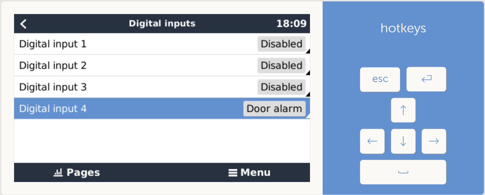

# Configure a switch

Plug a switch to any digital input of the GX device.

In the GX device console, in *Settings* -> *I/O* -> *Digital inputs*, configure the input as a "Door alarm" :

In the menu root, a new item "Door alarm" has appeared. Inside go to *Device* menu and set its name, for example "Inverter_switch"

