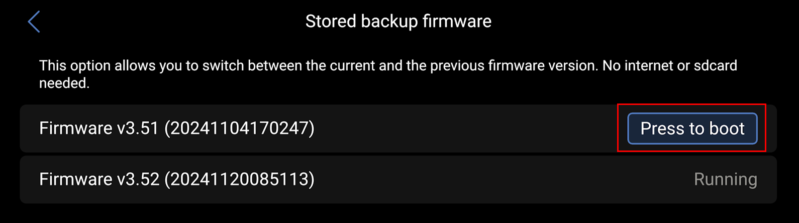
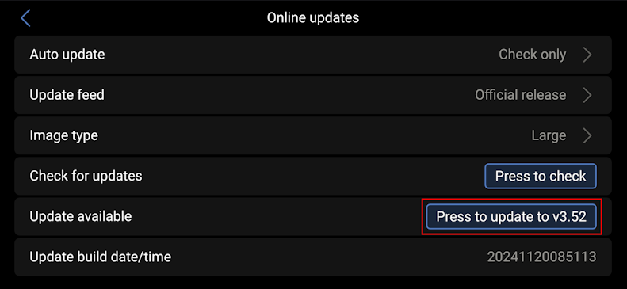

# Reset Venus OS

Maybe you have installed a bunch of packages, maybe you have deleted or modified a file you should not have.
Whatever the reason, you can reset everything very simply. 

Load previous firmware version by going in *Settings* -> *Firmware* -> *Stored backup firmware* -> *Press to boot* to load the N-1 version of Venus OS :

Launch the update process to version N from menu *Settings* -> *Firmware* -> *Online updates* -> *Press to update to vM.mm* to trigger the update :

> [!WARNING]  
> Do not restore version N through the menu Settings -> Firmware -> Stored backup firmware.

> [!NOTE]  
> After the update, everything on your device except the `/data` folder is reset. If you have cleaning to do there, do it manually. If you had configured drivers, certificates or anything, do it again.