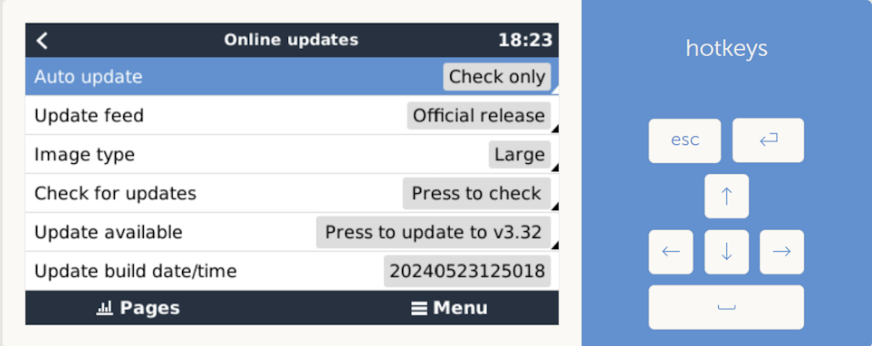
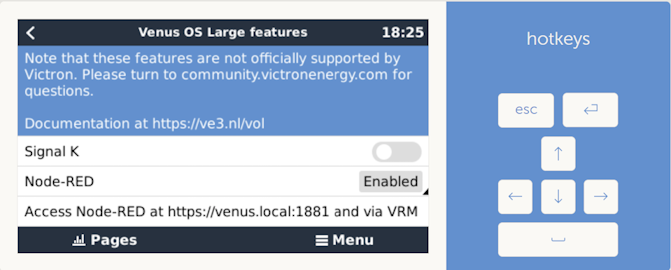

# Accessing Node RED

Once [Node RED is activated](#activate-node-red), it is available at https://venus.local:1881 (use local IP address if needed).

If prompted for login, user is *admin* and *password* is the one you have configured in *Settings* -> *General* -> *Set root password*.

## Activating Node RED

Node RED requires the installation of the "Large" version of the Venus OS firmware.
To do so go to *Settings* -> *Firmware* -> *Online updates*, set *Image type* to *Large*,
search latest firmware by clicking to *Press to check* and start the update with *Press to update to vM.mm* :



After the update, enable *Node-RED* in *Settings* -> *Venus OS Large features* :



## Activating dark mode

Create a file [`/data/home/nodered/.node-red/settings-user.js`](../shell/data/home/nodered/.node-red/settings-user.js) on your device with :

``` js
module.exports = {
    editorTheme: {
        theme: "dark"
    },
}
```

Reboot your device with `reboot` command.
