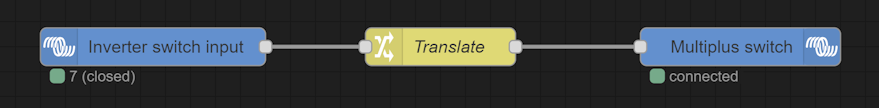
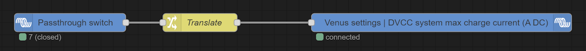

# Node-RED flows

* [Multiplus inverter switch](#multiplus-inverter-switch)
* [Multiplus passthrough switch](#multiplus-passthrough-switch)

## Multiplus inverter switch

This configuration lets you change your Multiplus device *Switch* state (*on* / *off* / *charger only* / *inverter only*) with a physical switch.

### Plug a switch

Follow the [switch configuration page](GuiV1-Configure_switch.md) to add a switch named *Inverter_switch*.

### Inverter switch flow

[Access Node RED](NodeRED-Activation.md) and import [Inverter switch flow](../nodered/NodeRED-Inverter_switch_flow.json) :

The *Translate* node translates the switch value into the desired Multiplus *Switch* value.
By default, it is :

| Inverter switch value    | Multiplus switch value |
|--------------------------|------------------------|
| 6 (open = off position)  | 3 (On)                 |
| 7 (closed = on position) | 1 (Charger only)       |

Double-click on the *Multiplus switch* node to see the allowed values. Change the *Translate* node as desired.

## Multiplus passthrough switch

This configuration allows you to stop battery charge while keeping 220v on without activating the inverter, hence its name, 220V "pass through" Multiplus.

In detail, it changes the *DVCC Limit charge current* value to *-1* (= unlimited charge) or *0* (= no charge) with a physical switch.

### Configure the passthrough switch

Follow the [switch configuration page](GuiV1-Configure_switch.md) to add a switch named *Passthrough_switch*.

### Node-RED Passthrough switch flow

[Access Node RED](NodeRED-Activation.md) and import [Passthrough switch flow](../nodered/NodeRED-Passthrough_switch_flow.json) :

The *Translate* node translates the switch value into the desired *DVCC Limit charge current* value.
By default, it is :

| Passthrough switch value | DVCC Limit charge current value |
|--------------------------|---------------------------------|
| 6 (open = off position)  | -1 (Unlimited)                  |
| 7 (closed = on position) | 0  (0A)                         |

