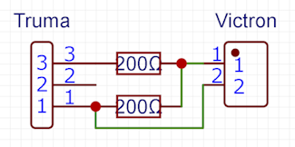
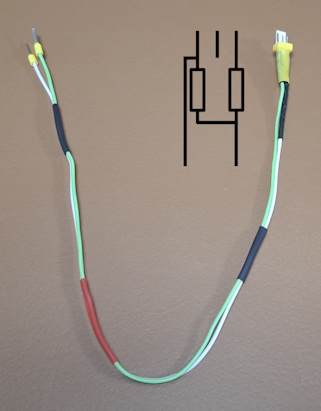
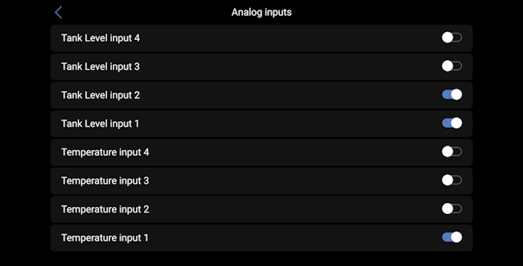
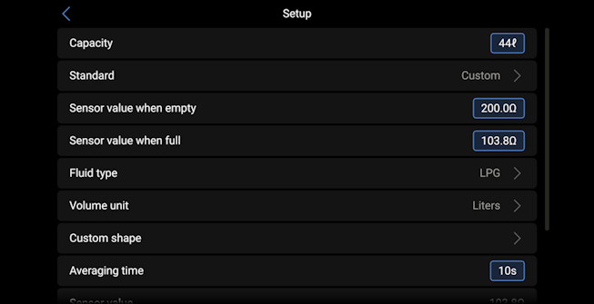
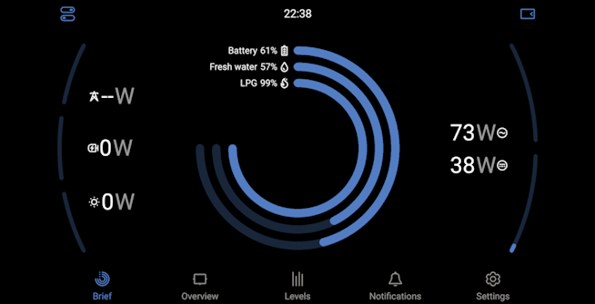

# Truma DuoC tank level sensor connection

Truma DuoC are control panels for DuoComfort, DuoControl and DuoControl CS gaz pressure regulators. The two models, older gray version and newer black version are technically identical, following guide can be used for all models.

DuoC tank level sensor is a simple switch that indicates if the primary tank is used or empty:  
  
bn = braun = brown, ge = gelb = yellow, rs = rosa = pink  
The connector is a 3 pins KF2510 female.

> [!NOTE]  
> Some cables have brown and pink cable inverted, as you can see in the diagram, it does not change anything.

You have two ways to connect it to your Venus OS device :
- [Through a digit input](#digital-input-connection) : quick and easy connection for data only use
- [Through a tank level input](#tank-connection) : needs a bit of ironing but allow for data and visualisation will get the information and a visualization

## Digital input connection

Connect brown and pink wire to a digital input and [configure it as a switch](./GuiV1-Configure_switch.md).

You can then access the data in Victron configuration screens or via [Node RED](./NodeRED-Activation.md) with a "Digital Input" node.

## Tank connection

### Adapter cable

Tank inputs require capacitive sensors, i.e. sensors with two wires between which the resistance changes following either :
- EU norm : from 0 to 180 ohm
- US norm : from 240 to 30 ohm
- Custom configuration : anything between 0 and 300 ohm, growing or downing

There are several ways to simulate a two step capacitive sensor from a switch, here is one of them using two resistors :

The value of the resistors is not very important but must be under 300 ohm which is tank inputs maximum value. In this example, the resistance are 200 ohm :
- when the primary tank is full, the switch is closed, the resistance between the two output wires is 100 ohm
- when the primary tank is empty, the switch is opened, the resistance between the two output wires is 200 ohm

Here is an  example of cable :

### Venus OS configuration

Once the cable is plugged, go to *Settings* -> *I/O* -> *Analog inputs* and activate the tank input you have plugged the cable in :

Go to *Settings* -> *Device list* -> new device named "[Type] tank [id]" -> *Device* to name the device.

Then go to *Settings* -> *Device list* -> new device named "[Type] tank [id]" -> *Setup* :
- In *Standard*, choose *Custom*
- In *Sensor value when empty*, set with the value of your resistors
- In *Sensor value when full*, set with half the value of your resistors
- In *Fluid type", choose *LPG*
- Optionally, set *Volume unit* and *Capacity* according to your tanks

On the main menu, you have now indication of the LPG level:

