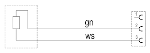
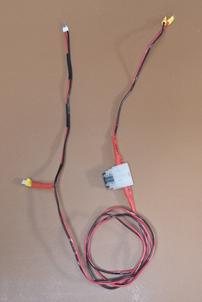
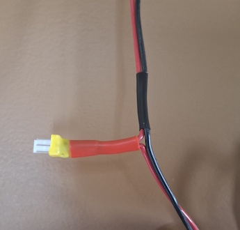
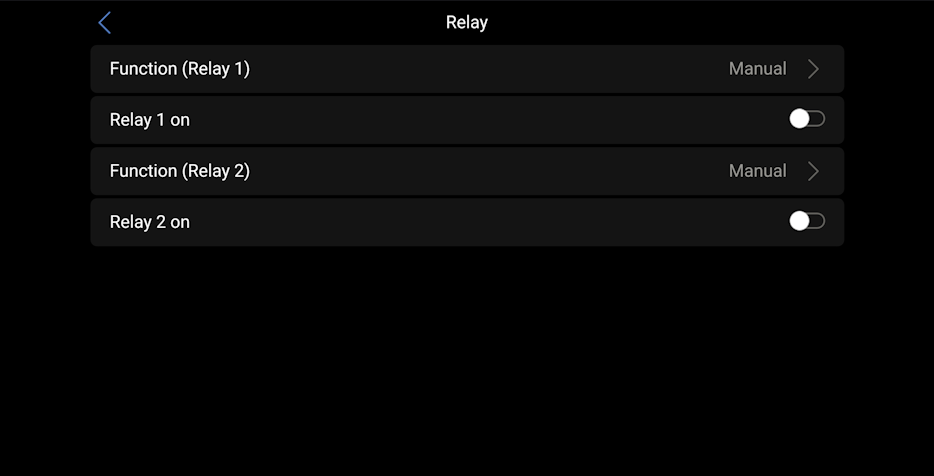
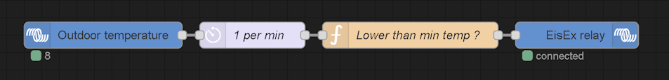

# Truma EisEx connection

Truma EisEx is a simple resistive heater, made to run at 12V, with 2W heat power.  
Here is the diagram :  
  
gn = grün = green, ws = weiss = white

As stated in [the documentation](./Truma-EisEx_documentation.pdf), it can be powered directly by the battery, with a 1A fuse protection, which can be controlled by a relay.

Here is an example of a cable to do so :  

Once the cable in plugged, activate the relay in *Settings* -> *Relay* -> *Function (Relay N)* and choose *Manual* :  

You can activate and deactivate EisEx on this screen or in the shortcuts page in the upper left corner icon.

To automate the activation of the EisEx based on external temperature, [go to Node-RED](./NodeRED-Activation.md), create a new flow, right click in the page, then *Insert* -> *Import* and import [this example flow](../nodered/NodeRED-EisEx_automation.json) :  

